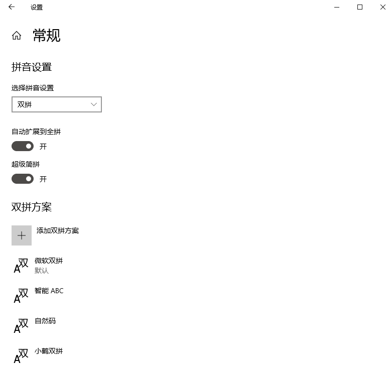

## 在 Win10 系统自带输入法上快速设置小鹤双拼方案

<div align=center></div>


### 说明

Win10 系统默认输入法可以选择双拼，默认只包含 **微软双拼** 、**智能ABC** 、**自然码** 3 种。

当然，可以手动添加 **小鹤双拼** 方案，为了避免浪费大量时间在影射键位上，收集了大佬们提供的修改注册表的方式，可以快速设置。

<div align=center></div>


### 使用

**方案一：** 手动修改注册表

1. 右键开始 → 运行 ( `Win` + `R` )：`Regedit`（注册表编辑器）
1. 定位计算机 `\HKEY_CURRENT_USER\Software\Microsoft\InputMethod\Settings\CHS`
1. 右键 → 新建字符串值
1. 数值名称： `UserDefinedDoublePinyinScheme0`
1. 数值数据： `小鹤双拼*2*^*iuvdjhcwfg^xmlnpbksqszxkrltvyovt`
1. 重启电脑（或许不用）

**方案二：** 使用注册表文件

双击执行 `xhup.reg` 文件

文件内容如下：

```
Windows Registry Editor Version 5.00

[HKEY_CURRENT_USER\Software\Microsoft\InputMethod\Settings\CHS]
"UserDefinedDoublePinyinScheme0"="小鹤双拼*2*^*iuvdjhcwfg^xmlnpbksqszxkrltvyovt"
```

>  有一些配置在 `"小鹤双拼*2*^*iuvdjhcwfg^xmlnpbksqszxkrltvyovt"` 中的 `g` 后面和该方案不同，多半是因为其设置了 `er` 韵的缘故，而小鹤双拼是不需要设置此韵的。


### 参考

- [[分享\] windows10小鹤双拼注册表（内置输入法的自定义）](https://bbs.flypy.com/forum.php?mod=viewthread&tid=166&extra=&page=1)
- [[教程\] win10快速添加小鹤双拼方案](https://flypy.com/bbs/forum.php?mod=forumdisplay&fid=2&filter=typeid&typeid=2) 
- [Win10 微软拼音添加小鹤双拼以及其他配置](https://ifttl.com/add-flypy-to-win10-microsoft-pinyin-and-other-configuration/)