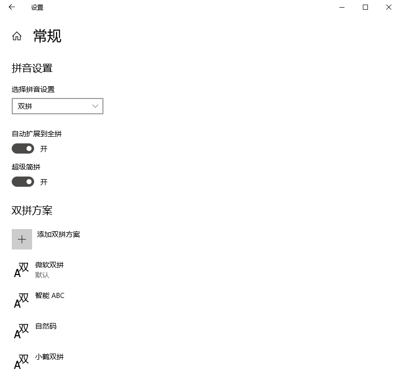

## 在 Win10 系统自带输入法上快速设置小鹤双拼方案

<div align=center></div>


### 说明

Win10 系统默认输入法可以选择双拼，默认只包含 **微软双拼** 、**智能ABC** 、**自然码** 3 种。

当然，可以手动添加 **小鹤双拼** 方案，为了避免浪费大量时间在影射键位上，收集了大佬们提供的修改注册表的方式，可以快速设置。

<div align=center></div>


### 使用

⭐️ **推荐方案：** 命令行添加注册表

1. 打开 Powershell 命令行：运行 ( `Win` + `R` )，输入 `cmd`
2. 输入以下内容
    ```
    reg add HKCU\Software\Microsoft\InputMethod\Settings\CHS /v UserDefinedDoublePinyinScheme0 /t REG_SZ /d "小鹤双拼*2*^*iuvdjhcwfg^xmlnpbksqszxkrltvyovt"
    ```
> 免责声明：  
> 这是当前收集到最简便的办法，配置好后去设置里切换即可。但我还没试过，不确定是否可用，不清楚为什么这里是 HKCU 缩写而其他方案里是 HKEY_CURRENT_USER 全称。


1️⃣ **其他方案一：** 手动修改注册表

1. 右键开始 → 运行 ( `Win` + `R` )：`Regedit`（注册表编辑器）
1. 定位计算机 `\HKEY_CURRENT_USER\Software\Microsoft\InputMethod\Settings\CHS`
1. 右键 → 新建字符串值
1. 数值名称： `UserDefinedDoublePinyinScheme0`
1. 数值数据： `小鹤双拼*2*^*iuvdjhcwfg^xmlnpbksqszxkrltvyovt`
1. 重启电脑（或许不用）


2️⃣ **其他方案二：** 使用注册表文件

双击执行 `xhup.reg` 文件

文件内容如下：

```
Windows Registry Editor Version 5.00

[HKEY_CURRENT_USER\Software\Microsoft\InputMethod\Settings\CHS]
"UserDefinedDoublePinyinScheme0"="小鹤双拼*2*^*iuvdjhcwfg^xmlnpbksqszxkrltvyovt"
```

>  有一些配置在 `"小鹤双拼*2*^*iuvdjhcwfg^xmlnpbksqszxkrltvyovt"` 中的 `g` 后面和该方案不同，多半是因为其设置了 `er` 韵的缘故，而小鹤双拼是不需要设置此韵的。

收集到其他注册表项的含义，可以自行添加到上述文件中，实现一步配置，供参考：

```
;云候选-关闭
"Enable Cloud Candidate"=dword:00000000

;动态调整-打开
"Enable Dynamic Candidate Ranking"=dword:00000001

;专业词典-开启
"EnableExtraDomainType"=dword:00000001

;自学习-开启
"EnableSmartSelfLearning"=dword:00000001

;上下文智能抽取-开启
"EnableHap"=dword:00000001

;人名模式-关闭
"EnablePeopleName"=dword:00000000

;开启定义双拼键位
"DoublePinyinScheme"=dword:0000000a

;导入小鹤双拼键位映射
"UserDefinedDoublePinyinScheme0"="小鹤双拼*2*^*iuvdjhcwfg^xmlnpbksqszxkrltvyovt"

;启用双拼模式
"Enable Double Pinyin"=dword:00000001

;设置候选词数量为 3 个
"CandidateListPageSize"=dword:00000003

;扩展到全拼-关闭
"Expand Double Pinyin"=dword:00000000

;扩展到简拼-关闭
"PinyinMixEnable"=dword:00000000
```

### 参考

- [Win10 微软拼音添加小鹤双拼以及其他配置](https://ifttl.com/add-flypy-to-win10-microsoft-pinyin-and-other-configuration/)
- [Windows 10/11 为微软拼音导入小鹤双拼方案](https://www.bilibili.com/opus/942918129513660489?jump_opus=1)
- ~~[windows10小鹤双拼注册表（内置输入法的自定义）](https://bbs.flypy.com/forum.php?mod=viewthread&tid=166&extra=&page=1)~~
- ~~[win10快速添加小鹤双拼方案](https://flypy.com/bbs/forum.php?mod=forumdisplay&fid=2&filter=typeid&typeid=2)~~
